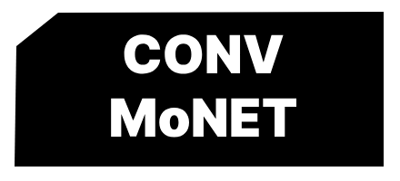

  

# ConvMoNET

Pet Project for handwritten doodle classification. 

## Description

Web Site for doodle classification using Convolutional Neural Networks.
It can:
1. Classify drawings
2. Generate drawings by text prompts
3. Animate humans on images

### Dependencies

* Libraries:
1. Tensorflow, Keras
2. Flask
3. NumPy
4. MatplotLib, Seaborn
5. Quickdraw API lib
* Data:
1. Google Quick, Draw Doodles <a href='https://github.com/googlecreativelab/quickdraw-dataset'>Data</a>: 

## Authors

Venchislav

ex. [@Venchislav](https://twitter.com/venchisla75545)

## Acknowledgments

Inspiration, code snippets, etc.
* [awesome-readme](https://github.com/matiassingers/awesome-readme)
* [Quick, Draw data](https://github.com/googlecreativelab/quickdraw-dataset)
* [Inspired](https://www.youtube.com/watch?v=hfMk-kjRv4c)
* [Google Quick, Draw](https://quickdraw.withgoogle.com/)
* [random parts of the code](https://stackoverflow.com/)

Haystacks at Giverny - Claude Monet 1884 

# Work In Progress...
 
<h1>Classifier works and first version of web-site is done!🎉🥳🎊</h1>
UPD from 01.02.24 - I'll dive into GANs and generative nets so I'll be studying it for the project 
If your property is used in project (stored in static/images) you can contact: okponponok23@gmail.com 
___
UPD from 15.02.24: 
**New Project Vision** 
Animatisse section will be replaced with TUNER 
___
MEET THE TUNER!!! 
TUNER uses Variational Autoencoder for image generation 
Add smile, glasses, and other with TUNER 

___
Work in progress 
 
<h1>UPD from 20.02.24:</h1>final project vision<h1> 
<h2>doodle generation will be replaced with painting generation</h2>. Art gallery with database will be added to share generated images. For image generation stable diffusion will be used.  
___
<h1>UPD from 24.02.24:</h1>
<h2>Now I will dive into Machine Learning, Statistics and well all this stuff in order to destroy this "Black Box" effect.</h2>  
<h3>So now it's a deep dive into ML</h3>
